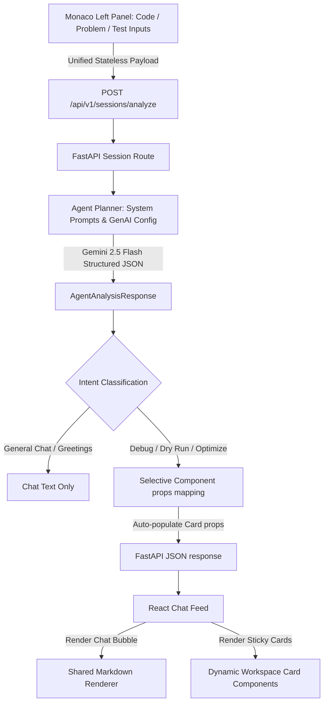

# CodeMentor AI Agent

An interactive educational DSA coding assistant that helps you analyze, debug, optimize, and run text-based step-by-step walkthroughs of your solutions using an integrated, language-agnostic Generative UI flow.

---

## 💡 The Core Concept

When practicing Data Structures and Algorithms (DSA), developers often face two distinct friction points:
1. **Cluttered workspaces** where compilers, test cases, and chat logs are spread across disconnected windows.
2. **Generic AI responses** that dump huge walls of markdown text in a tiny chat bubble instead of offering structured, visual, and context-aware explanations.

**CodeMentor AI** resolves this by pairing a language-agnostic code editor workspace with a **Generative UI Agent Chat**. Rather than returning generic text blocks, the agent determines the user's intent and dynamically plans a structured interface. The relevant educational cards (Dry Runs, Code Viewers, Bug Diagnoses) are rendered **inline directly inside the chat thread**, chronological and stuck to the specific conversation step that created them.

---

## 🛠️ Architecture & Flow

The system is split into a Python FastAPI backend and a React/TypeScript frontend. It focuses on conversational AI mentoring and dynamic, selective layout generation.



### 🔄 Interactive Flow Steps
1. **Workspace Inputs**: The user inputs their solution code (in *any* language), the DSA problem statement, and active sample test inputs on the Left Panel.
2. **Unified API Request**: When the user chats, the query text is sent inline along with the workspace code variables directly to the backend `/api/v1/sessions/analyze` endpoint.
3. **Conversational Intent Routing**:
   * Simple greetings (e.g., `"hi"`) or general conceptual queries (e.g., `"What is dynamic programming?"`) are handled via conversational chat with no workspace component rendering.
   * Debugging, dry-run, or optimization inquiries trigger Gemini 2.5 Flash to generate a type-safe visual `UIPlan` containing only the relevant cards.
4. **Selective Component Planning**: The agent plans only the UI components that directly answer the query:
   * `dry_run_markdown`: Detailed narrative step-by-step code walkthroughs.
   * `code_viewer`: Code solutions/templates with clipboard copy support.
   * `bug_analysis`: Bug diagnosis and failing counterexample parameter blocks.
   * `solution_comparison`: Side-by-side time/space complexity matrix comparison.
5. **Dynamic Actions**: The agent dynamically generates suggested follow-up chips based on the active state. Clicking a chip submits the agent-configured query back to the thread.
6. **Sticky Visual Layout**: Generated workspace components are rendered **inline inside the chat bubble thread**, chronological and stuck to the specific agent response that yielded them.

---

## ✨ Features

### 1. Split-Screen Layout
* **Left Panel**: Tabbed interface featuring:
  * **Monaco Editor**: A fully functional code editor supporting syntax highlighting and editing.
  * **Problem Description**: Simple text area to input the target LeetCode or DSA problem description.
  * **Test Cases**: Interface to manage multiple sample test inputs.
* **Right Panel**: A scrolling chronological conversational thread that houses the agent chat, visual output cards, and contextual actions.

### 2. Generative UI Visual Cards
* **Educational Dry Run Walkthrough (`dry_run_markdown`)**: Narrative text-based trace simulating indices, values, loop checks, and recursion frames step-by-step.
* **Bug Diagnosis & Counterexample (`bug_analysis`)**: Highlights the logical bug, recommends a code fix, and provides failing inputs side-by-side (Failing input, Expected, Actual).
* **Code Viewer Snippet (`code_viewer`)**: Formatted code container supporting syntax highlighted templates with inline copy-to-clipboard buttons.
* **Complexity Matrix (`solution_comparison`)**: Displays a side-by-side complexity grid comparing the user's current approach with the optimal standard solution.

### 3. Dynamic Contextual Action Chips
* Suggested actions are generated in real-time by the AI based on the conversation context (e.g. suggesting `"🔍 Run Dry Run"` after a bug diagnosis, or `"🚀 Show Optimal Solution"` after analyzing a brute force approach).

### 4. Native Markdown & Styling Engine
* Built-in markdown-to-React component parser that formats bold text, bulleted lists, headers, inline tags, and blocks.
* Typography themes using **Space Grotesk** (display headings), **DM Sans** (body text), and **JetBrains Mono** (code components).

---

## 💻 Tech Stack

### Backend
* **Python**: Core programming language.
* **FastAPI**: Modern, high-performance web framework for APIs.
* **Uvicorn**: Lightning-fast ASGI server implementation.
* **Google GenAI SDK**: Interfaces directly with Gemini models (`gemini-2.5-flash`) with structured schema definitions.
* **Pydantic**: Data validation and settings management using Python type annotations.

### Frontend
* **React**: Component-based UI library.
* **TypeScript**: Static type definitions.
* **Vite**: Ultra-fast frontend build tooling.
* **Tailwind CSS v4**: Utility-first CSS framework.
* **Monaco Editor**: High-quality browser-based code editor engine.
* **Lucide React**: Clean, lightweight interface icons.

---

## 📂 Repository Layout

```
backend/
├── agents/              # Agent Planning & Prompt Configuration
│   ├── tool.py          # Google ADK tool decoration wrapper
│   ├── prompts.py       # Consolidated detailed system prompts
│   └── planner.py       # Gemini API planner & post-processing props mapper
├── app/
│   ├── main.py          # FastAPI app server entrypoint
│   ├── config.py        # Environment configurations
│   └── schemas/
│       └── analysis.py  # Standalone request/response schemas
├── api/routes/
│   └── sessions.py      # Session Analysis routing endpoints
└── execution/
    └── test_agent.py    # E2E verification of analysis and routing
frontend/
├── src/
│   ├── components/      # UI Layout & Cards Components
│   │   ├── cards/
│   │   │   ├── BugAnalysisCard.tsx
│   │   │   ├── CodeViewerCard.tsx
│   │   │   ├── DryRunMarkdownCard.tsx
│   │   │   ├── ProblemSummaryCard.tsx
│   │   │   └── SolutionComparisonCard.tsx
│   │   ├── DynamicWorkspace.tsx
│   │   └── RightAgentWindow.tsx
│   ├── utils/
│   │   └── markdown.tsx # Shared Markdown Preview Renderer
│   ├── types/
│   │   └── ui.ts        # Dynamic actions and component types
│   ├── App.tsx          # Main workspace coordinator
│   └── index.css        # Font imports and theme classes
```

---

## 🚀 Quick Start & Verification

### 📋 Prerequisites
* **Python 3.10+**
* **Node.js 18+**
* **Google Gemini API Key** configured in your environment.

### 1. Setup Backend
1. Navigate to the project root and create a virtual environment:
   ```bash
   python -m venv venv
   # Activate on Windows:
   .\venv\Scripts\activate
   # Activate on Unix:
   source venv/bin/activate
   ```
2. Install Python dependencies:
   ```bash
   pip install -r requirements.txt
   ```
3. Configure your API key. Create a `.env` file in the root:
   ```env
   GEMINI_API_KEY="your-gemini-api-key-here"
   ```

### 2. Verify Backend Planning & Routing
Run E2E agent planner tests:
```powershell
python backend/execution/test_agent.py
```

### 3. Start Backend API Server
```powershell
uvicorn backend.app.main:app --reload
```

### 4. Setup & Start Frontend React Client
```powershell
cd frontend
npm install
npm run dev
```
Open [http://localhost:5173](http://localhost:5173) in your browser to start debugging and optimizing your solutions!
