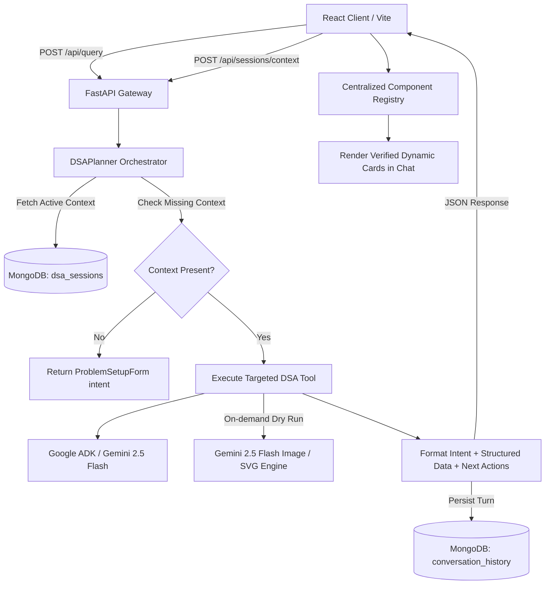

# CodeMentor AI⚡

> **An interactive, conversational Data Structures & Algorithms (DSA) mentor with dynamic Generative UI, visual dry-run illustrations, and persistent session memory.**

**CodeMentor AI** acts like an experienced tech lead or algorithms coach pair-programming right beside you:
- **Conversational & Non-Intrusive**: You chat naturally in real time. The chat interface is persistent and never disappears.
- **Generative Visual UI**: Instead of raw text or messy JSON, CodeMentor dynamically plans and renders rich visual cards directly in the chat stream: interactive bug breakdowns, side-by-side complexity matrices, failing counterexamples, and illustrated dry-run diagrams.
- **Conceptual & Language-Agnostic**: It does not rely on rigid compilers. It analyzes the pure algorithmic logic of your code in C++, Python, Java, JavaScript, Go, or Rust.
- **Persistent Context**: You submit your problem and draft code once; CodeMentor remembers your workspace throughout the session so you can ask follow-ups like *"Why does it fail on duplicates?"* or *"Show me the optimal solution"* without re-pasting anything.

---

## Key Features

### 1. Comprehensive Solution Analysis
Submit your problem and draft code in any major programming language. CodeMentor AI evaluates:
- **Algorithm & Pattern Classification**: Recognizes two-pointer, sliding window, dynamic programming, backtracking, monotonic stack, etc.
- **Correctness Classification**: Evaluates whether your solution is:
  - `Correct & Optimal`
  - `Correct but Suboptimal`
  - `Right Idea, Buggy Implementation`
  - `Incorrect Approach`
- **Strengths & Limitations**: Identifies what works well and points out hidden traps or memory inefficiencies.

### 2. Pinpoint Bug Diagnosis & Failing Counterexamples
When code fails:
- **Root Cause Explanation**: Explains exactly *why* the code fails conceptually (e.g., integer overflow, off-by-one pointer error, missing edge case for negative numbers).
- **Failing Counterexample**: Provides a minimal failing test case and contrasts **Your Code's Output** vs. **Expected Output**.
- **Targeted Fix**: Explains how to correct the logic without rewriting everything from scratch.

### 3. On-Demand Visual Dry Runs (AI Illustrated)
Instead of manually tracing loops on pencil and paper:
- Request a dry run anytime.
- CodeMentor AI generates an educational diagram using **Gemini Multimodal Image Generation** paired with an SVG vector fallback.
- Visualizes array indices, pointer movements, recursion stacks, and hash map states.
- Includes a full-screen **Lightbox Modal** with download capabilities for offline revision.

### 4. Guided Optimizations & Side-by-Side Comparisons
- **Optimal Transition**: Learn how to optimize a brute-force $O(N^2)$ solution into an optimal $O(N)$ or $O(N \log N)$ approach.
- **Comparison Matrix**: View a side-by-side comparison of **Your Approach** vs. **Optimal Approach** detailing time complexity, auxiliary memory, and algorithmic trade-offs.

### 5. In-Depth Complexity Derivation
- Asymptotic time and space complexity with step-by-step mathematical reasoning.
- Bottleneck identification (e.g., nested loop overhead or auxiliary hash table memory).
- Best-case, average-case, and worst-case bounds.

### 6. Click Contextual Action Chips
- After every response, CodeMentor presents 1–3 smart next-action chips (e.g., `Run Dry Run`, `Debug Edge Cases`, `Show Optimal`, `Compare Approaches`).
- Clicking any action executes the query in the **same active session** without repetitive typing.

### 7. Multi-Session History Management
- All sessions are automatically saved to MongoDB.
- Open the **Session History Drawer** to switch between different problems you've worked on, inspect message history, or clean up past sessions.
- Browser `localStorage` recovery ensures that refreshing the page never loses your active workspace.

---

## Core Architecture & Design Philosophy



### Architectural Principles

1. **Non-Compiler Conceptual Approach**:
   No heavy execution sandboxes (g++, python sub-processes, or Docker containers). The assistant evaluates conceptual algorithm semantics, which avoids environmental discrepancies and enables instant response across any programming language.

2. **Controlled Generative UI**:
   The LLM **never** emits raw HTML or executable JSX. Instead, the backend enforces a controlled structured responses, while frontend safely maps each type to a registered React component:
   - `problem_setup_form` $\rightarrow$ Interactive setup form
   - `problem_summary` $\rightarrow$ Problem statement, pattern, constraints card
   - `approach_card` $\rightarrow$ Algorithmic logic, data structures, complexity badges
   - `bug_analysis_card` $\rightarrow$ Failure cause, failing condition, fix snippet
   - `counterexample_card` $\rightarrow$ Input, actual vs. expected output
   - `dry_run_image` $\rightarrow$ Step trace + visual diagram with lightbox
   - `optimization_card` $\rightarrow$ Improved algorithmic approach & code
   - `solution_comparison_card` $\rightarrow$ Side-by-side trade-off matrix
   - `code_viewer` $\rightarrow$ Formatted snippet with syntax highlight & code copy
   - `complexity_card` $\rightarrow$ Code complexity & bottleneck analysis

---

## Tech Stack

| Layer | Technologies |
| :--- | :--- |
| **Backend** | **FastAPI** |
| **Agent Engine** | **Google ADK**, **Google GenAI SDK** |
| **Database** | **MongoDB** |
| **Data Validation** | **Pydantic** |
| **Frontend** | **React (Vite)**, **TypeScript**, **Tailwind CSS** |

---

## Setup Guide

### Prerequisites

- **Python 3.10+** (Python 3.12 recommended)
- **Node.js 18+** & **npm**
- **MongoDB** running locally (`mongodb://localhost:27017`) or a free MongoDB Atlas connection string
- A **Gemini API Key** from [Google AI Studio](https://aistudio.google.com/)

---

### 1. Configure Backend

```bash
cd CodeMentor-AI

# Create and activate Python virtual environment
# Windows:
python -m venv venv
.\venv\Scripts\Activate.ps1

# Linux / macOS:
python3 -m venv venv
source venv/bin/activate

# Install Python dependencies
pip install -r backend/requirements.txt
```

Create or verify `backend/.env`:
```env
GEMINI_API_KEY=
MONGODB_URL=
DATABASE_NAME=
```

Start the FastAPI backend server:
```bash
python -m uvicorn backend.main:app --host 0.0.0.0 --port 8000 --reload
```
- **API Base URL**: `http://localhost:8000/api`
- **Interactive Swagger Docs**: `http://localhost:8000/docs`

---

### 2. Configure Frontend

```bash
cd CodeMentor-AI/frontend
npm install
```

Create or verify `frontend/.env`:
```env
VITE_API_URL=http://localhost:8000/api
```

Start the Vite development server:
```bash
npm run dev
```

Open your browser at: **`http://localhost:5173`**

---
